# Weather App

A simple weather app that displays the temperature based on city.  
API used -> [**Weather API**](https://www.weatherapi.com).

## Table of contents

- [Weather App](#weather-app)
  - [Table of contents](#table-of-contents)
  - [Screenshot](#screenshot)
  - [Plugins](#plugins)
  - [Author](#author)

## Screenshot

|                                            |                                            |
| ------------------------------------------ | ------------------------------------------ |
| 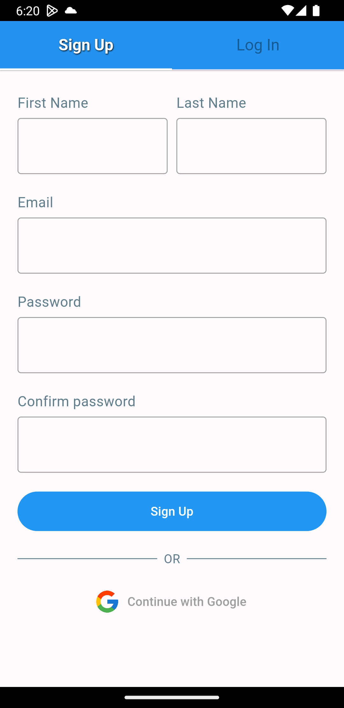 | 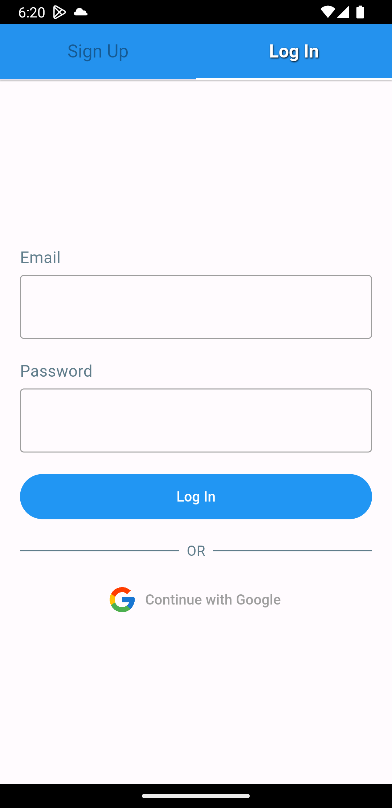 |
| 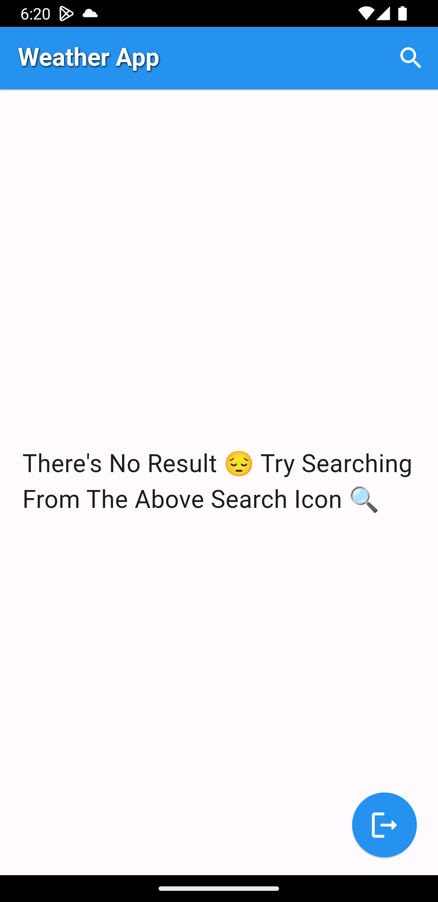 | 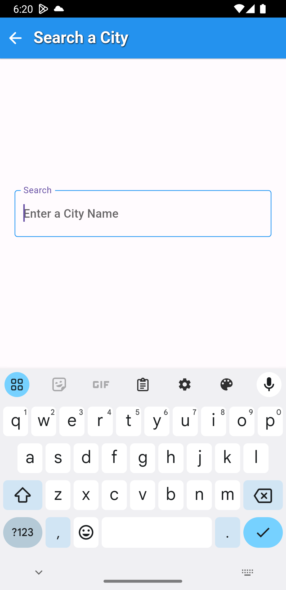 |
| 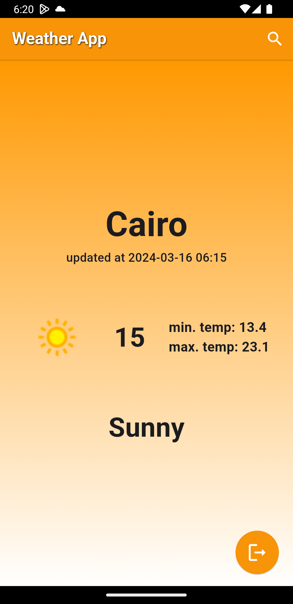 | 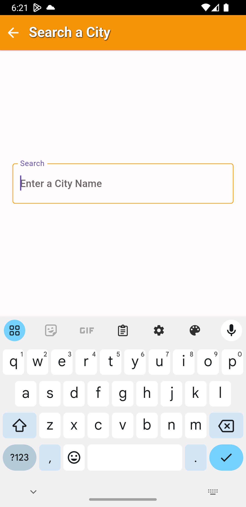 |
| 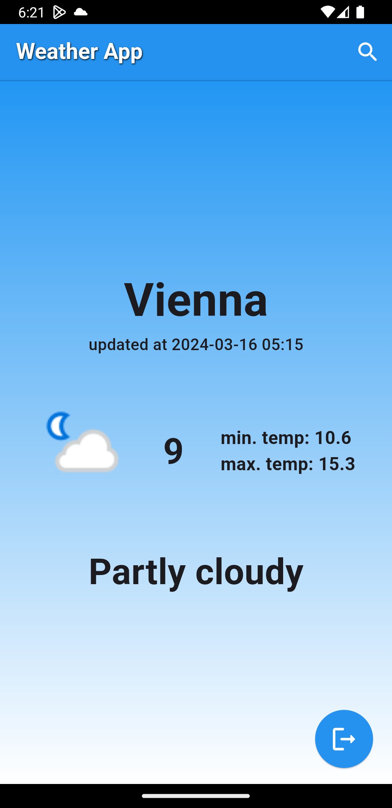 | 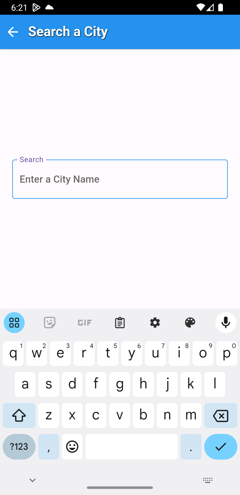 |
| 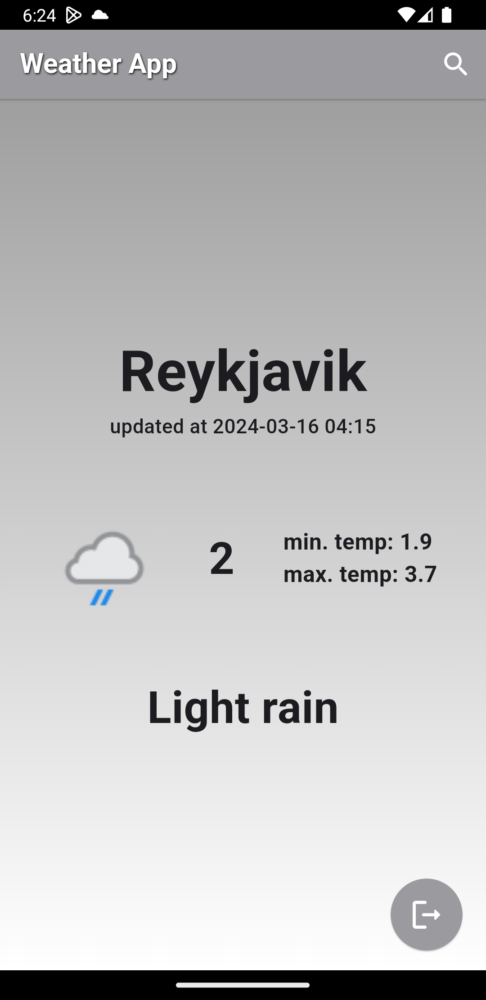 | 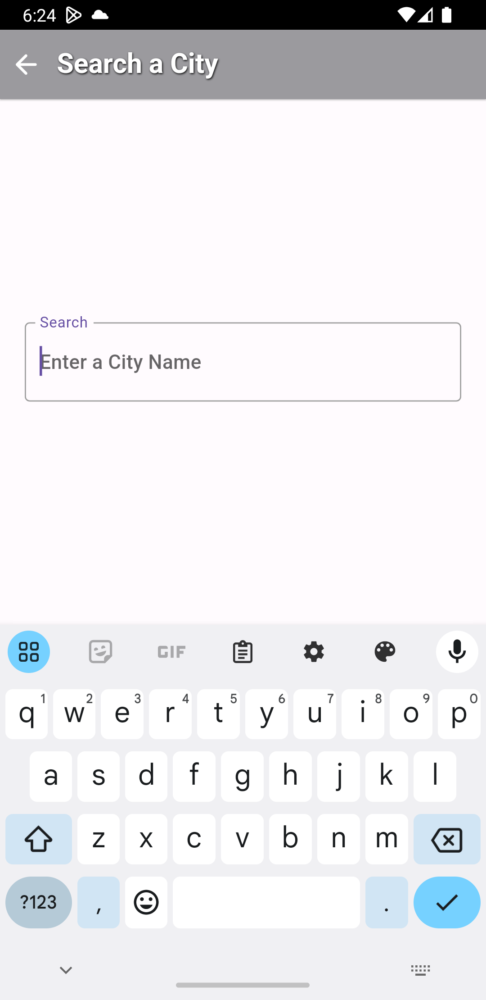 |
| 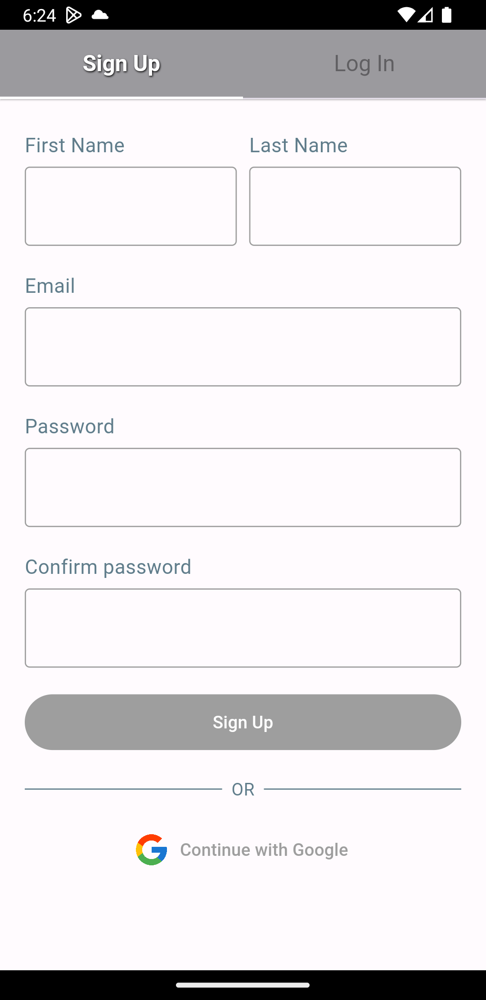 | 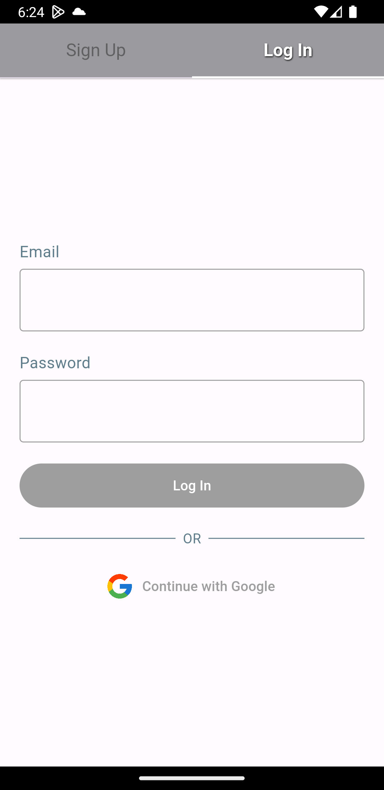 |

## Plugins

| Name                                                          | Usage                            |
| ------------------------------------------------------------- | -------------------------------- |
| [**Flutter_Bloc**](https://pub.dev/packages/flutter_bloc)     | State Management                 |
| [**DIO**](https://pub.dev/packages/dio)                       | Handling API                     |
| [**Firebase_auth**](https://pub.dev/packages/firebase_auth)   | User Authentication              |
| [**Google_Sign_In**](https://pub.dev/packages/google_sign_in) | Users Storing and Authentication |

## Author

- Linkedin - [Alyaa Ahmed](https://www.linkedin.com/in/alyaa-ahmed/)
